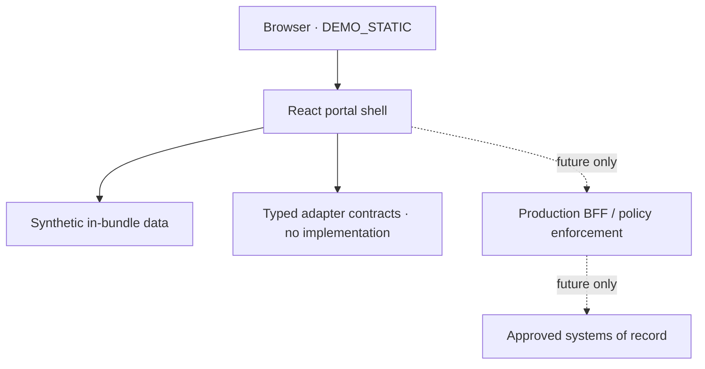

# Architecture

## Milestone topology

`DEMO_STATIC` is a React/TypeScript/Vite single-page application using relative assets and hash routing. It reads only source-controlled synthetic records, keeps interactive state in React memory, performs no network calls, and emits no source maps.

The dotted path is not implemented and must not be described as operational.

## Source layout

- `src/app`: 12 L1 routes (Home plus 11 approved domains), shell, Action Center, module and shared-state views.
- `src/i18n`: bilingual UI context and stable shared copy.
- `src/domain`: Zod validation and canonical entity vocabulary.
- `src/data`: synthetic demo records only.
- `src/security`: default-deny production authorization policy skeleton.
- `src/adapters`: typed interfaces with health, pagination, timeout, correlation, and idempotency context.
- `docs`: architecture, boundaries, governance, operations, and ADRs.

## Production reference

Production requires a BFF/API layer behind a managed reverse proxy. OIDC Authorization Code + PKCE terminates at the BFF; sessions use Secure, HttpOnly, SameSite cookies and are rotated/revoked server-side. Every read, search, export, and write is authorized at request time using verified role and resource attributes. Tokens are never placed in browser storage.

Each system of record is isolated behind a typed adapter. Default behavior is `not-configured`; missing credentials must not trigger an external request or create a real case. Retry policy applies only to retry-safe operations and write retries require an idempotency key.

## Non-goals

The portal is not a replacement database for SIEM, ITSM, GRC, CMDB/CAASM, DMS, code security, or PSIRT. It is a controlled experience layer with authorized summaries and traceable deep links.
